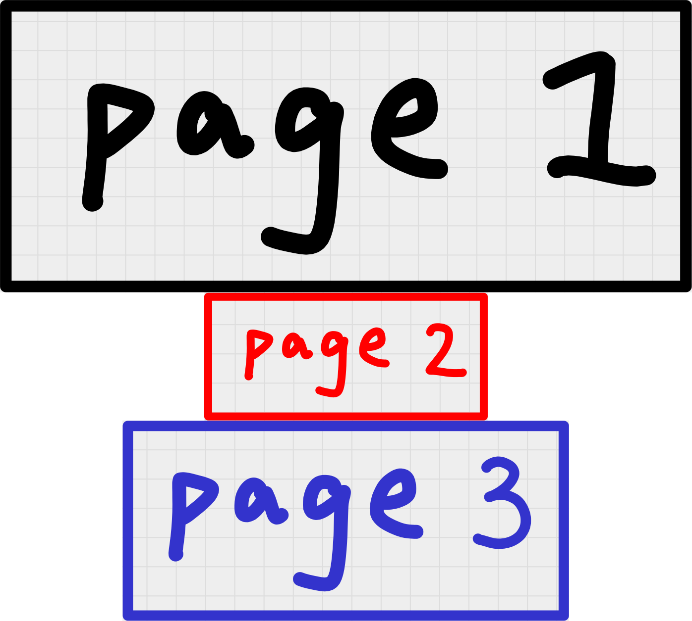
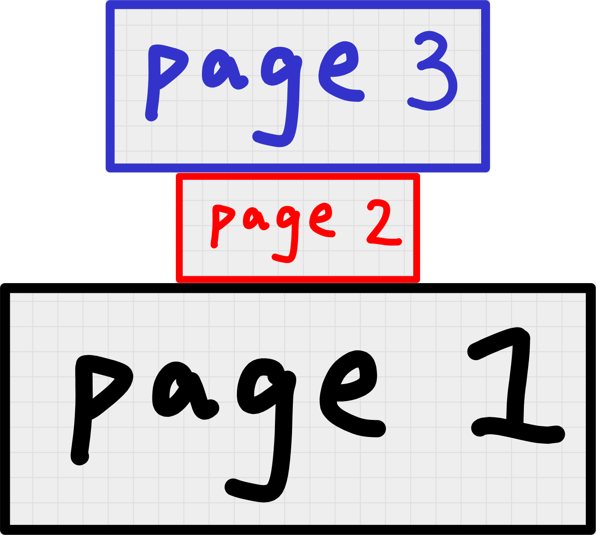
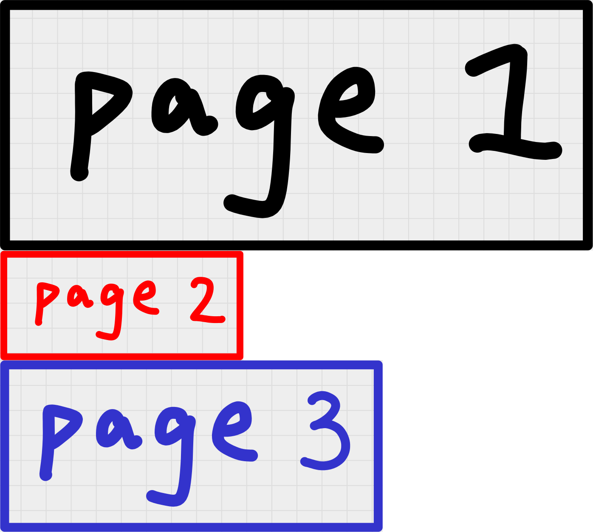
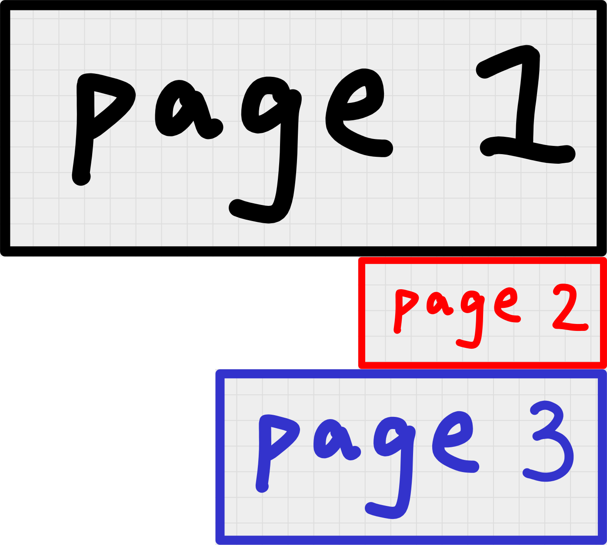
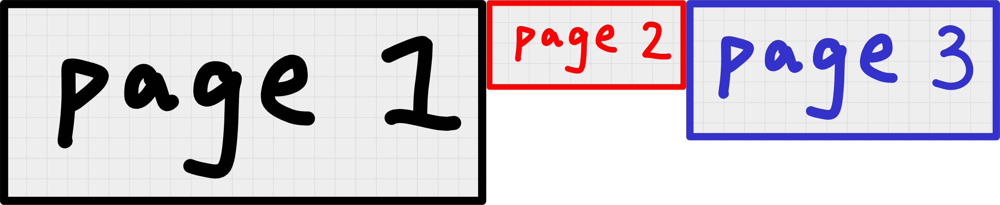
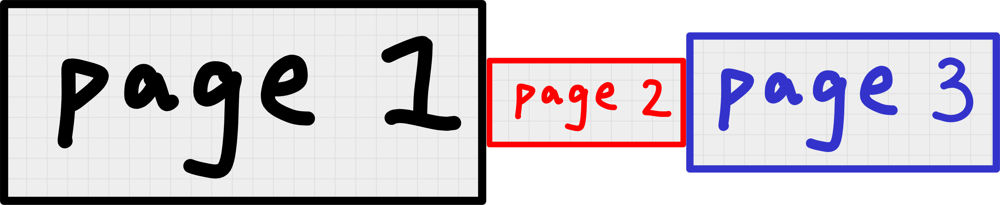
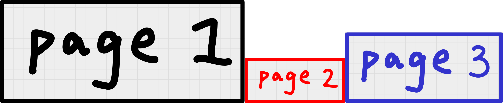

# :material-table-merge-cells: Combine

## Overview

The Combine Operation would combine the images in the pipeline into one image.

## Configuration

Use "combine" as the type of the operation.

Keys in "config":

| Key              | Type   | default value | Description                                                                                                                                                                                 |
| ---------------- | ------ | ------------- | ------------------------------------------------------------------------------------------------------------------------------------------------------------------------------------------- |
| direction        | string | `"ttb"`       | There are 4 options: `"ttb"`, `"btt"`, `"ltr"`, `"rtl"`<br>`"ttb"` means "top to bottom"<br>`"btt"` means "bottom to top"<br>`"ltr"` means "left to right"<br>`"rtl"` means "right to left" |
| horizontal_align | string | `"center"`    | There are 3 options: `"left"`, `"center"`, `"right"`<br>This applies when "direction" is `"ttb"` or `"btt"`.                                                                                |
| vertical_align   | string | `"center"`    | There are 3 options: `"top"`, `"center"`, `"bottom"`<br>This applies when "direction" is `"ltr"` or `"rtl"`.<br>                                                                            |

### Examples

Take [this xopp file](xopps/three_pages.xopp) as an example.


#### Direction

=== ":material-arrow-down-bold: ttb (top to bottom)"

    { width="400", align=right }

    ```json title="config.json" hl_lines="13"
    {
        "pipeline": [
            {
                "type": "load",
                "config": {
                    "paper_background_preserved": true,
                    "trim": true
                }
            },
            {
                "type": "combine",
                "config": {
                    "direction": "ttb"
                }
            },
            {
                "type": "save"
            }
        ]
    }
    ```

    

=== ":material-arrow-up-bold: btt (bottom to top)"

    { width="400", align=right }

    ```json title="config.json" hl_lines="13"
    {
        "pipeline": [
            {
                "type": "load",
                "config": {
                    "paper_background_preserved": true,
                    "trim": true
                }
            },
            {
                "type": "combine",
                "config": {
                    "direction": "btt"
                }
            },
            {
                "type": "save"
            }
        ]
    }
    ```

    

=== ":material-arrow-right-bold: ltr (left to right)"

    { width="400", align=right }

    ```json title="config.json" hl_lines="13"
    {
        "pipeline": [
            {
                "type": "load",
                "config": {
                    "paper_background_preserved": true,
                    "trim": true
                }
            },
            {
                "type": "combine",
                "config": {
                    "direction": "ltr"
                }
            },
            {
                "type": "save"
            }
        ]
    }
    ```

    

=== ":material-arrow-left-bold: rtl (right to left)"

    { width="400", align=right }

    ```json title="config.json" hl_lines="13"
    {
        "pipeline": [
            {
                "type": "load",
                "config": {
                    "paper_background_preserved": true,
                    "trim": true
                }
            },
            {
                "type": "combine",
                "config": {
                    "direction": "rtl"
                }
            },
            {
                "type": "save"
            }
        ]
    }
    ```

    

#### Horizontal alignment

=== ":material-format-align-left: left"

    { width="400", align=right }

    ```json title="config.json" hl_lines="14"
    {
        "pipeline": [
            {
                "type": "load",
                "config": {
                    "paper_background_preserved": true,
                    "trim": true
                }
            },
            {
                "type": "combine",
                "config": {
                    "direction": "ttb",
                    "horizontal_align": "left"
                }
            },
            {
                "type": "save"
            }
        ]
    }
    ```
    

=== ":material-format-align-center: center"

    { width="400", align=right }

    ```json title="config.json" hl_lines="14"
    {
        "pipeline": [
            {
                "type": "load",
                "config": {
                    "paper_background_preserved": true,
                    "trim": true
                }
            },
            {
                "type": "combine",
                "config": {
                    "direction": "ttb",
                    "horizontal_align": "center"
                }
            },
            {
                "type": "save"
            }
        ]
    }
    ```
    

=== ":material-format-align-right: right"

    { width="400", align=right }

    ```json title="config.json" hl_lines="14"
    {
        "pipeline": [
            {
                "type": "load",
                "config": {
                    "paper_background_preserved": true,
                    "trim": true
                }
            },
            {
                "type": "combine",
                "config": {
                    "direction": "ttb",
                    "horizontal_align": "right"
                }
            },
            {
                "type": "save"
            }
        ]
    }
    ```

#### Vertical alignment

=== ":material-align-vertical-top: top"

    { width="400", align=right }

    ```json title="config.json" hl_lines="14"
    {
        "pipeline": [
            {
                "type": "load",
                "config": {
                    "paper_background_preserved": true,
                    "trim": true
                }
            },
            {
                "type": "combine",
                "config": {
                    "direction": "ltr",
                    "vertical_align": "top"
                }
            },
            {
                "type": "save"
            }
        ]
    }
    ```

=== ":material-align-vertical-center: center"

    { width="400", align=right }

    ```json title="config.json" hl_lines="14"
    {
        "pipeline": [
            {
                "type": "load",
                "config": {
                    "paper_background_preserved": true,
                    "trim": true
                }
            },
            {
                "type": "combine",
                "config": {
                    "direction": "ltr",
                    "vertical_align": "center"
                }
            },
            {
                "type": "save"
            }
        ]
    }
    ```

=== ":material-align-vertical-bottom: bottom"

    { width="400", align=right }

    ```json title="config.json" hl_lines="14"
    {
        "pipeline": [
            {
                "type": "load",
                "config": {
                    "paper_background_preserved": true,
                    "trim": true
                }
            },
            {
                "type": "combine",
                "config": {
                    "direction": "ltr",
                    "vertical_align": "bottom"
                }
            },
            {
                "type": "save"
            }
        ]
    }
    ```