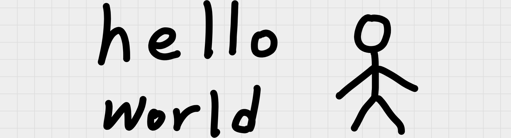

# :material-file-upload: Load

## Overview

:material-file-upload: The Load Operation would load the xournal++ note as images into the pipeline.  
:material-crop-free: It can also trim "empty" margin of the note at the same time.

## Configuration

Use the string "load" as the type of the operation.

Keys in "config":

| Key                        | Type               | Default value              | Description                                                                                                                                                                                                                                                                                                                                                                                                                                                                                           |
| -------------------------- | ------------------ | -------------------------- | ----------------------------------------------------------------------------------------------------------------------------------------------------------------------------------------------------------------------------------------------------------------------------------------------------------------------------------------------------------------------------------------------------------------------------------------------------------------------------------------------------- |
| paper_background_preserved | boolean            | `false`                    | :octicons-dot-fill-16: Whether to preserve paper backgrounds of xournal++ note. <br>:octicons-dot-fill-16: This setting only affect pages without pdf. <br>:warning: Enable this option (set it to true) will increase the export time.                                                                                                                                                                                                                                                               |
| pdf_background_transparent | boolean            | `false`                    | :octicons-dot-fill-16: If pages' pdf's backgrond is transparent, whether to preserve its transparent background. <br> :octicons-dot-fill-16: This setting only affect pages with pdf. <br> :warning: Enable this option (set it to true) will significantly increase the export time.                                                                                                                                                                                                                 |
| trim                       | boolean            | `false` (\*)               | :octicons-dot-fill-16: Whether to crop "empty" margins of notes.<br>:octicons-dot-fill-16: "Empty" doesn't mean transparent, "empty" means no content. (see examples below)<br>:octicons-dot-fill-16: If it is set to false, then "direction_enabled" would have no effect.<br>:octicons-dot-fill-16: If you doesn't assign a value to "crop_empty_margins", and assign a list with at least 1 `true` value to "direction_enabled", then value of "crop_empty_margins" would be viewed as `true`.<br> |
| trim_directions            | array of 4 boolean | `[true, true, true, true]` | :octicons-dot-fill-16: Enable cropping empty margins in the direction of left, top, right, and bottom.                                                                                                                                                                                                                                                                                                                                                                                                |
| trim_paddings              | array of 4 integer | `[0, 0, 0, 0]`             | :octicons-dot-fill-16: Adjust the cropping boundary in the direction of left, top, right, and bottom. <br>:octicons-dot-fill-16: If the value is positive, it would leave a space outside of the original cropping boundary. If the value is negative, it would cropping deeper into the image. (see examples below)                                                                                                                                                                                  |

### Example (without pdf)

Take [this xopp file](xopps/demo_one_page.xopp) as an example.
This xopp has only 1 page, and it doesn't have pdf background.
(So "pdf_background_transparent" have no effect for this file's export)

=== "Default"

    { width="400", align=right}

    ```json title="config.json" hl_lines="4"
    {
        "pipeline": [
            {
                "type": "load"
            },
            {
                "type": "save" // (1)!
            }
        ]
    }
    ``` 

    1. We don't set "config", so the defaul values are used.

    !!! note
        The transparent background might not be visible in white background,  
        Try toggling between light and dark mode or downlaoding the image to see the effect.


=== "Preserve paper background"

    { width="400", align=right}

    ```json title="config.json" hl_lines="6"
    {
        "pipeline": [
            {
                "type": "load",
                "config": {
                    "paper_background_preserved": true
                }
            },
            {
                "type": "save"
            }
        ]
    }
    ```


=== "Trim"

    { width="400", align=right}

    ```json title="config.json" hl_lines="7"
    {
        "pipeline": [
            {
                "type": "load",
                "config": {
                    "paper_background_preserved": true,
                    "trim": true
                }
            },
            {
                "type": "save"
            }
        ]
    }
    ```


=== "directions"

    { width="400", align=right} 

    ```json title="config.json" hl_lines="8"
    {
        "pipeline": [
            {
                "type": "load",
                "config": {
                    "paper_background_preserved": true,
                    "trim": true,
                    "trim_directions": [false, true, false, true] // (1)!
                }
            },
            {
                "type": "save"
            }
        ]
    }
    ```

    1. We set "trim directions" to trim only top and bottom.  
    (The order of the directions is left, top, right, bottom)
    


=== "Paddings"

    { width="400", align=right}

    ```json title="config.json" hl_lines="9"
    {
        "pipeline": [
            {
                "type": "load",
                "config": {
                    "paper_background_preserved": true,
                    "trim": true,
                    "trim_directions": [false, true, false, true],
                    "trim_paddings": [0, 50, 0, 50] // (1)!
                }
            },
            {
                "type": "save"
            }
        ]
    }
    ```

    1. We leave some paddings for top and bottom.  
    (The order of the directions is left, top, right, bottom)


=== "Negative paddings"

    { width="400", align=right}

    ```json title="config.json" hl_lines="9"
    {
        "pipeline": [
            {
                "type": "load",
                "config": {
                    "paper_background_preserved": true,
                    "trim": true,
                    "trim_directions": [false, true, false, true], 
                    "trim_paddings": [0, -50, 0, -50] // (1)!
                }
            },
            {
                "type": "save"
            }
        ]
    }
    ```

    1.  We set negative paddings for top and bottom, so the image would be cropped deeper in the top and bottom.  
    (The order of the directions is left, top, right, bottom)


### Example (with pdf)

Take this set of [xopp file](xopps/two_pages_with_pdf.xopp) and [pdf](xopps/two_pages_with_pdf.xopp.bg.pdf) as an example.

This xopp has 2 pages, the first page has pdf background, and the second page doesn't.

- "paper_background_preserved" only affect pages without pdf background, 
- "pdf_background_transparent" only affect pages with pdf background.

=== "Config 1" 

    { width="400", align=right}

    ```json title="config.json" hl_lines="6 7"
    {
        "pipeline": [
            {
                "type": "load",
                "config": {
                    "paper_background_preserved": false,
                    "pdf_background_transparent": false,
                    "trim": true,
                    "trim_directions": [false, true, false, true]
                }
            },
            {
                "type": "combine"
            },
            {
                "type": "save"
            }
        ]
    }
    ```

    !!! note
        The transparent background might not be visible in white background,  
        Try toggling between light and dark mode or downlaoding the image to see the effect.

=== "Config 2" 

    { width="400", align=right}

    ```json title="config.json" hl_lines="6 7"
    {
        "pipeline": [
            {
                "type": "load",
                "config": {
                    "paper_background_preserved": false,
                    "pdf_background_transparent": true,
                    "trim": true,
                    "trim_directions": [false, true, false, true]
                }
            },
            {
                "type": "combine"
            },
            {
                "type": "save"
            }
        ]
    }
    ```

    !!! note
        The transparent background might not be visible in white background,  
        Try toggling between light and dark mode or downlaoding the image to see the effect.


=== "Config 3" 

    { width="400", align=right}

    ```json title="config.json" hl_lines="6 7"
    {
        "pipeline": [
            {
                "type": "load",
                "config": {
                    "paper_background_preserved": true,
                    "pdf_background_transparent": false,
                    "trim": true,
                    "trim_directions": [false, true, false, true]
                }
            },
            {
                "type": "combine"
            },
            {
                "type": "save"
            }
        ]
    }
    ```

    

    !!! note
        The transparent background might not be visible in white background,  
        Try toggling between light and dark mode or downlaoding the image to see the effect.

=== "Config 4" 

    { width="400", align=right}

    ```json title="config.json" hl_lines="6 7"
    {
        "pipeline": [
            {
                "type": "load",
                "config": {
                    "paper_background_preserved": true,
                    "pdf_background_transparent": true,
                    "trim": true,
                    "trim_directions": [false, true, false, true]
                }
            },
            {
                "type": "combine"
            },
            {
                "type": "save"
            }
        ]
    }
    ```

    
    !!! note
        The transparent background might not be visible in white background,  
        Try toggling between light and dark mode or downlaoding the image to see the effect.